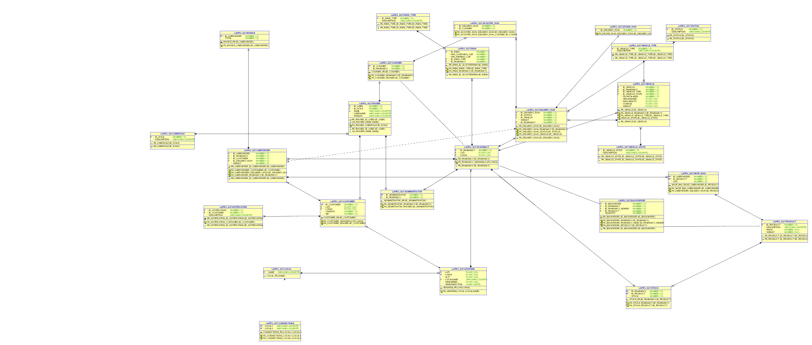

# Report

# Abstract #
A software company needs to develop a product that supports the delivery of pharmaceutical products.
This service should allow managing clients, products, orders, deliveries, etc.

### Keywords:
* User
* Administrator
* Client
* Pharmacy
* Scooter
* Drone
* Park
* Path
* Order
* Product

# Introduction #
The purpose of this report is to document the entire development process of LAPR3's final project.

The development process of this project was based on the knowledge acquired in the other curricular units of this semester (ESINF, BDDAD, ARQCP and FSIAP) 
and also on LAPR3's Scrum Methodology and Jira.

For ESINF we used Data Structures and for BDDAD the Databases. 
We also applied analysis and design engineering and object oriented programming (OO) patterns learned so far.

The aim of this project is to create a software which allows an administrator to manage it's parks, drones, scooters and the application users. 
It also allows users to order the delivery of certain products from farmacies, namely vaccines and other medication necessary. The user should gain points with every order made,
be able to pay with those points and to receive an invoice.
Finally, for couriers it should suggest the best routes for delivery, which vehicle to use in a delivery run and notify them when a vehicle is charging and how long it will take 
via email notification.

This report is divided into 3 parts:

* Problem Statement

* Solution

* Conclusion

# State of the Art #
After research about the state of the art of software related to the one we are developing, we found the following:

* asuafarmaciaonline: a portuguese online pharmacy with ordering system that can be used all over Europe. [1]

* Ema.europa: A list of online websites where you can order medicine from any one of the countries listed. [2]

# Problem Statement #
In response to LAPR3 Project Assignment, we had to develop a software that allows the administrator the management of pharmacies, parks and vehicles,
the client to order products from a certain pharmacy and the courier to select the best possible route for delivering products, taking into account energy resources, distances
and delivery points (client's address).
The software must be implemented in JAVA coding language and the data should persist in a Database(SQL).
The software must be capable of supporting the management of pharmacy businessess.

# Solution #
The solution we came up with is a software that is able to answer the proposed requisits, focusing specially in a correct way to process and store the data on the database.
Our software consists on a service based on unitary and integration tests through the assessment project.

## Super Administrator

### Pharmacies
Relatively to Pharmacies, a super administrator can:

* Add Pharmacy

* Remove Pharmacy


## Administrator

### Vehicles
An admistrator can manage the vehicles in his pharmacy:

* Add Drones

* Add Electric Scooters

* Remove Drones

* Remove Electric Scooters

* Add Drone Park

* Add Electric Scooters

* Remove Drone Park

* Remove Electric Scooters

### Pharmacies
An administrator can:

* Create a back-order when there's not enough stock of a product to finish an order

### Courier
An admistrator can manage the couriers in his pharmacy:

* Add a Courier

* Remove a Courier

## Client

* Register an account in the system as a non registered user

### Order
Relatively to Orders, the client can:

* Order a product from any pharmacy

* Receive an invoice about his order

## Courier

* Receive an email notification confirming the start of the charging of the vehicle and how long it will take to charge

# Conclusion #
In conclusion, throughout this project we were able to apply the acquired knowledge we had to develope the propper solution to the problem.

We have finished almost every item in our backlog, with the exception of some that had lower priority, like calculating how long a vehicle will take to fully charge.
We implemented integration tests to check and demonstrate the operation of our software, including database accesses.
Besides that, during the project's development we enccountered some dificulties along the way but we were able to resolve most of them via comunication and team work.
Like any product, there's always room for improvemnt, but we can say we are happy with our final product.

# References #
[1]	"asuafarmaciaonline".[Online].Available:https://www.asuafarmaciaonline.pt/envio-de-encomendas.html

[2] "Ema.europe".[Online].Available:https://www.ema.europa.eu/en/human-regulatory/overview/public-health-threats/falsified-medicines/buying-medicines-online#list-of-registers-of-online-medicine-retailers-section

# US Diagram


# User Stories Documentation

| User Stories |                   
|:----------------------------------------------------------------------------|
| [US38 - Add Electric Scooter](documentation/US_38_Add_Electric_Scooters/CD_US_38_Add_Scooter.PNG) |
| [US39 - Remove Electric Scooter](documentation/US_39_Remove_Electric_Scooter/CD_US_39_remove_Scooter.png) |
| [US40 - User Registration](documentation/US_40_User_Registration/CD_US_40_User_Registration.png) |
| [US41 - Compute Energy Route](documentation/US_41_Compute_Energy_Route/CD_US_41_Compute_Energy_Route.png) |
| [US68 - Check Stock product](documentation/US_68_Check_Product_Stock/CD_US_68_Check_Stock_product.PNG) |
| [US69 - Generate Invoice](documentation/US_69_Generate_Invoice/CD_US_69_Generate_Invoice.PNG) |
| [US70 - Create Notification for Removed Product](documentation/US_70_Create_Notification_Removed_Product/CD_US_70_Create_Notification_Product.PNG) |
| [US71 - Earn Credits Client](documentation/US_71_Earn_Credits_Client/CD_US_71_Earn_credits.PNG) |
| [US73 - Update stock](documentation/US_73_Update_Stock/CD_US_73_Update_Stock.PNG) |
| [US102 - Register Courier](documentation/US_102_Register_courier/CD_US_102_Register_Courier.PNG) |
| [US104 - Create User Orders](documentation/US_104_Create_UserORders/CD_US_104_Creta_User_Order.PNG) |
| [US106a - Add Pharmacy](documentation/US_106a_Add Pharmacy/CD/CD_US_106a_Add Pharmacy.png) |
| [US106b - Remove Pharmacy](documentation/US_106b_Remove Pharmacy/CD/CD_US_106b_Remove Pharmacy.png) |
| [US109 - Add Drone](documentation/US_109_Add_Drone/CD_US_109_Add_Drone.jpg) |
| [US110 - Remove Drone](documentation/US_110_Remove_Dronre/CD_US_110_REMOVE_DRONE.jpg) |
| [US113 - Check product's stock](documentation/US_113_Verify_If_Product_has_no_stock_left/ManageBackOrder_CheckProductHasStock_CD.png) |
| [US114 - Get Nearest Pharmacy](documentation/US_114_CheckNearbyPharmaciesForMissingProduct/ManageBackOrder_GetNearestPharmacy_CD.png) |
| [US115 - Create Back Order transfer note](documentation/US_115_CreateBackOrderTransferNote/ManageBackOrder_CreateBackOrderTransferNote_CD.png) |
| [US116 - Add Park](documentation/US_116_117_Add_Parks/CD_US_116_117_Add_Park.PNG) |
| [US117 - Remove Park](documentation/US_116_117_Remove_Parks/CD_US_116_117_Remove_Park.PNG) |
| [US119 - Pay with credits](documentation/US_119_Pay_with_credits/CD_US_119_Pay_With_Cred.PNG) |
| [US154 - Remove Courier](documentation/US_154_Remove_Courier/CD_US_154_Remove_Courier.PNG) |
| [US166 - Add Delivery](documentation/US_166_Add_Delivery/CD_US_166_Add_Delivery.jpg) |

# Relational Model


#=======================================================================|End of Report|====================================================

# README

This is the repository template used for student repositories in LAPR Projets.

## Java source files

Java source and test files are located in folder src.

## Maven file

Pom.xml file controls the project build.

# Notes
In this file, DO NOT EDIT the following elements:

* groupID
* artifactID
* version
* properties

Beside, students can only add dependencies to the specified section of this file.

## Eclipse files

The following files are solely used by Eclipse IDE:

* .classpath
* .project

## IntelliJ Idea IDE files

The following folder is solely used by Intellij Idea IDE :

* .idea

# How was the .gitignore file generated?
.gitignore file was generated based on https://www.gitignore.io/ with the following keywords:

  - Java
  - Maven
  - Eclipse
  - NetBeans
  - Intellij

# Who do I talk to?
In case you have any problem, please email Nuno Bettencourt (nmb@isep.ipp.pt).

# How do I use Maven?

## How to run unit tests?

Execute the "test" goals.

`$ mvn test`

## How to generate the javadoc for source code?

Execute the "javadoc:javadoc" goal.

`$ mvn javadoc:javadoc`

This generates the source code javadoc in folder "target/site/apidocs/index.html".

## How to generate the javadoc for test cases code?

Execute the "javadoc:test-javadoc" goal.

`$ mvn javadoc:test-javadoc`

This generates the test cases javadoc in folder "target/site/testapidocs/index.html".

## How to generate Jacoco's Code Coverage Report?

Execute the "jacoco:report" goal.

`$ mvn test jacoco:report`

This generates a jacoco code coverage report in folder "target/site/jacoco/index.html".

## How to generate PIT Mutation Code Coverage?

Execute the "org.pitest:pitest-maven:mutationCoverage" goal.

`$ mvn test org.pitest:pitest-maven:mutationCoverage`

This generates a PIT Mutation coverage report in folder "target/pit-reports/YYYYMMDDHHMI".

## How to combine different maven goals in one step?

You can combine different maven goals in the same command. For example, to locally run your project just like on jenkins, use:

`$ mvn clean test jacoco:report org.pitest:pitest-maven:mutationCoverage`

## How to perform a faster pit mutation analysis?

Do not clean build => remove "clean"

Reuse the previous report => add "-Dsonar.pitest.mode=reuseReport"

Use more threads to perform the analysis. The number is dependent on each computer CPU => add "-Dthreads=4"

Temporarily remove timestamps from reports.

Example:

`$ mvn test jacoco:report org.pitest:pitest-maven:mutationCoverage -DhistoryInputFile=target/fasterPitMutationTesting-history.txt -DhistoryOutputFile=target/fasterPitMutationTesting-history.txt -Dsonar.pitest.mode=reuseReport -Dthreads=4 -DtimestampedReports=false`

## Where do I configure my database connection?

Each group should configure their database connection on file: 

* src/main/resources/application.properties

# Oracle repository

If you get the following error:

```
[ERROR] Failed to execute goal on project 
bike-sharing: Could not resolve dependencies for project 
lapr3:bike-sharing:jar:1.0-SNAPSHOT: 
Failed to collect dependencies at 
com.oracle.jdbc:ojdbc7:jar:12.1.0.2: 
Failed to read artifact descriptor for 
com.oracle.jdbc:ojdbc7:jar:12.1.0.2: 
Could not transfer artifact 
com.oracle.jdbc:ojdbc7:pom:12.1.0.2 
from/to maven.oracle.com (https://maven.oracle.com): 
Not authorized , ReasonPhrase:Authorization Required. 
-> [Help 1]
```

Follow these steps:

https://blogs.oracle.com/dev2dev/get-oracle-jdbc-drivers-and-ucp-from-oracle-maven-repository-without-ides

You do not need to set a proxy.

You can use existing dummy Oracle credentials available at http://bugmenot.com.